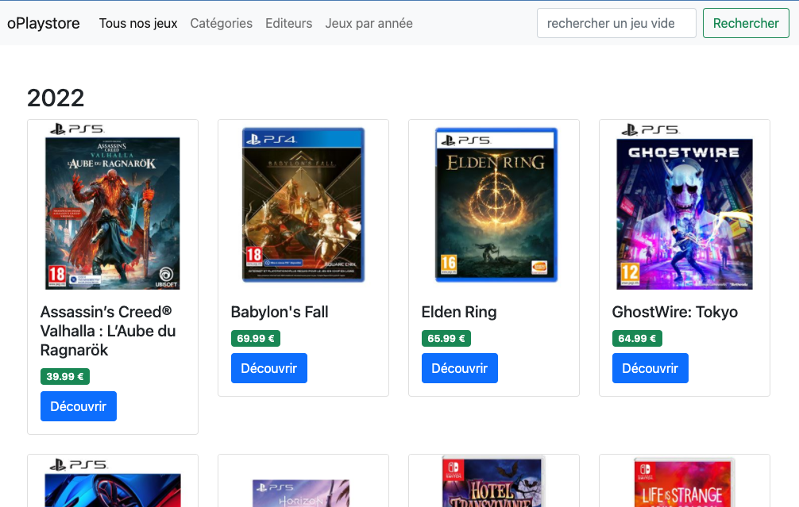
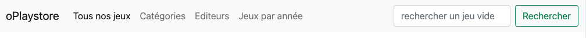
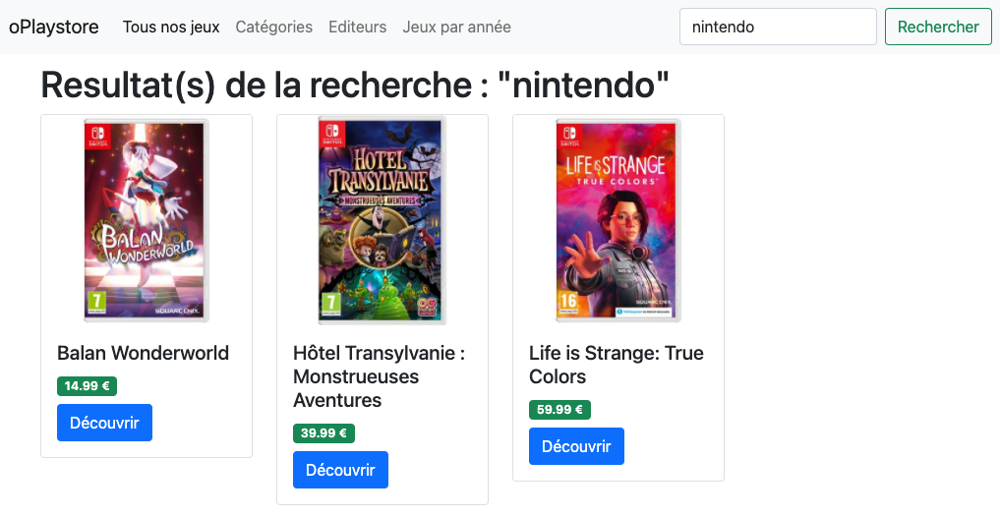

# Challenge parcours MVC

Tu as maintenant une application MVC entre les mains. Il reste encore 2 pages à faire. Tu trouveras ci-dessous les maquettes de ces 2 pages.

## Jeux classés par année

Il faudra que tu tries les jeux par années, et que tu fasses une section par année sur la page.

## BONUS : Moteur de recherche

Ajouter le champs de recherche dans la barre de menu. Ce champ de recherche devra être fonctionnel, et à la soumission en `POST`, une recherche devra être effectuée sur les jeux. Le résultat de la recherche sera à afficher sur la page des résultats ( maquette plus bas ).

À toi de décider si tu fais la recherche seulement sur le titre, la description, l'éditeur etc. ou sur plusieurs champs en même temps.

Page d'affichage des résultats :

